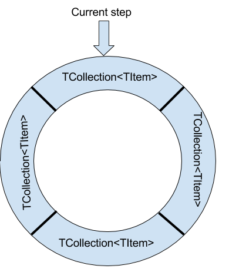

# Decaying-Collections
.NET library that provides thread-safe collections that automatically remove their elements after a particular time has passed. Each instance of a decaying collection has a timespan specified which is used as a lifespan for its elements.

## Contents

Currently there are two implemented Decaying collections:
- `DecayingHashSet<TItem>` - behaves like HashSet but with decaying behavior. Does not implement ISet;
- `DecayingBag<TItem>` - allows repetitions but stil unordered;
- `DecayingDictionary<TKey, TValue>` - Dictionary with decaying behavior, implements IDictionary;

## Design

**Warning:** Decaying collections use [System.Threading.Timer](https://msdn.microsoft.com/en-us/library/system.threading.timer(v=vs.110).aspx) internally. See MSDN for details on possible implications.

All decaying collections inherit from the abstract class `DecayingCollection<TItem, TCollection>` where `TCollection` is `ICollection<TItem>`. This class instantiates `steps` (an optional argument of decaying collection constructors) ICollection instances in a "ring". One of the collections is marked as current. All items are added to the collection in the current step.

A timer is configured to notify the DecayingCollection on `lifespan` (constructor argument) divided by `steps` seconds. Each time the ring rotated and the next collection is set to current. All items in the new current collection are removed (they have decayed). `ItemDecayed` event is raised for each item which has decayed.